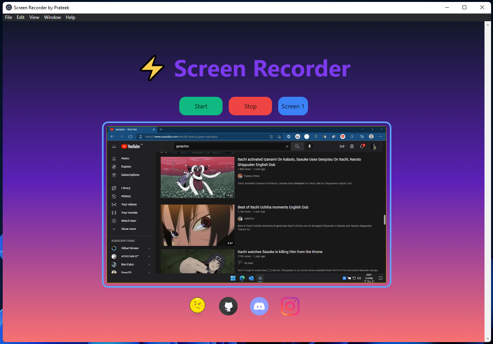

# ScreenRecorder
- ### This is a screen recording application. You can record any screen or any window currently opened on your desktop
- ### Just download setup file compatible with your OS and try it for yourself. To download your compatible version click [here](https://github.com/prateek332/ScreenRecorder/releases)
- ### Windows-x64 users, click [here](https://github.com/prateek332/ScreenRecorder/releases/download/v1.0/screenrecorder-1.0.0.Setup.exe) to download the file.
- ### Linux-x64 debian distros users, click [here](https://github.com/prateek332/ScreenRecorder/releases/download/v1.0/screenrecorder_1.0.0_amd64.deb) to download the file.
- ### If you cant' find setup file compatible with your OS then you can build your application by cloning the repository or download the source code and simply building the app yourself.
- ### If you need any help, then contact me through social links in my profile

  

